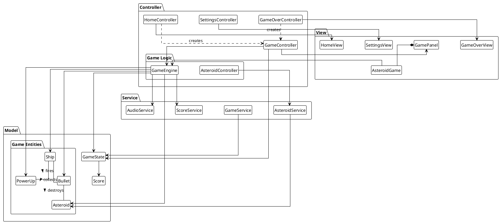

# UML Class Diagrams for Asteroid Game

## High-Level Class Interaction Diagram

## Detailed Class Diagram

```plantuml
@startuml Asteroid Game - Detailed Class Diagram
!theme plain
skinparam classAttributeIconSize 0
skinparam linetype polyline
hide circle

' Model classes
package "Model" {
  class GameState {
    -score: int
    -lives: int
    -gameSpeed: double
    +getScore(): int
    +setScore(int): void
    +getLives(): int
    +setLives(int): void
    +getGameSpeed(): double
    +setGameSpeed(double): void
  }
  
  class Score {
    -value: int
    -highScore: int
    +increment(int): void
    +reset(): void
    +getValue(): int
    +getHighScore(): int
  }
  
  package "Game Entities" {
    class Ship {
      -x: double
      -y: double
      -velocityX: double
      -velocityY: double
      -rotation: double
      -thrusting: boolean
      +update(int, int): void
      +rotateLeft(): void
      +rotateRight(): void
      +setThrusting(boolean): void
      +getNoseCoordinates(): double[]
    }
    
    class Asteroid {
      -x: double
      -y: double
      -width: int
      -height: int
      -directionX: double
      -directionY: double
      -size: int
      -speed: double
      +move(): void
      +isOffScreen(int, int): boolean
      +getBounds(): Rectangle
    }
    
    class Bullet {
      -x: double
      -y: double
      -directionX: double
      -directionY: double
      -lifespan: int
      +update(int, int): boolean
      +getBounds(): Rectangle
    }
    
    class PowerUp {
      -x: int
      -y: int
      -type: int
      -active: boolean
      +move(): void
      +activate(): void
      +isActive(): boolean
      +getBounds(): Rectangle
    }
  }
}

' View classes
package "View" {
  class HomeView {
    -btnStart: JButton
    -btnSettings: JButton
    -btnExit: JButton
    +getBtnStart(): JButton
    +getBtnSettings(): JButton
    +getBtnExit(): JButton
  }
  
  class GamePanel {
    -game: AsteroidGame
    -scoreLabel: JLabel
    -onGameOver: Runnable
    +getGameView(): AsteroidGame
    +updateScoreDisplay(int): void
  }
  
  class AsteroidGame {
    -gameEngine: GameEngine
    -scoreLabel: JLabel
    +setGameEngine(GameEngine): void
    +updateScoreDisplay(): void
    +keyPressed(KeyEvent): void
  }
  
  class GameOverView {
    -lblFinalScore: JLabel
    -btnRestart: JButton
    -btnMainMenu: JButton
    +setFinalScore(int): void
    +getBtnRestart(): JButton
    +getBtnMainMenu(): JButton
  }
  
  class SettingsView {
    -chkAudio: JCheckBox
    -btnSave: JButton
    -btnCancel: JButton
    +getChkAudio(): JCheckBox
    +getBtnSave(): JButton
    +getBtnCancel(): JButton
  }
}

' Controller classes
package "Controller" {
  class HomeController {
    -view: HomeView
    -frame: JFrame
    -gameService: GameService
    -audioService: AudioService
    +startGame(): void
    +showSettings(): void
  }
  
  class GameController {
    -state: GameState
    -service: GameService
    -view: GamePanel
    -gameEngine: GameEngine
    +updateView(): void
    +updateScore(int): void
    +setAudioEnabled(boolean): void
  }
  
  class GameOverController {
    -gameService: GameService
    -finalScore: int
    +showGameOver(JFrame, int): void
    +restartGame(JFrame): void
    +returnToMainMenu(JFrame): void
  }
  
  class SettingsController {
    -view: SettingsView
    -audioService: AudioService
    +saveSettings(): void
    +showHome(): void
  }
  
  class GameEngine {
    -timer: Timer
    -ship: Ship
    -asteroids: List<Asteroid>
    -bullets: List<Bullet>
    -powerUps: List<PowerUp>
    -gameState: GameState
    -gameOver: boolean
    +start(): void
    +stop(): void
    +actionPerformed(ActionEvent): void
    +fireBullet(): void
    +rotateShipLeft(): void
    +rotateShipRight(): void
    +thrustShip(boolean): void
    +setOnGameOver(Runnable): void
  }
  
  class AsteroidController {
    -asteroidService: AsteroidService
    +updateAsteroidsSpeed(List<Asteroid>, double): void
  }
}

' Service classes
package "Service" {
  class GameService {
    +updateScore(GameState, int): void
    +decrementLives(GameState): boolean
    +createNewGameState(): GameState
  }
  
  class AudioService {
    -audioEnabled: boolean
    +playShootSound(): void
    +playExplosionSound(): void
    +playGameOverSound(): void
    +setAudioEnabled(boolean): void
  }
  
  class ScoreService {
    -highScore: int
    +getAsteroidPoints(int): int
    +updateHighScore(int): boolean
  }
  
  class AsteroidService {
    +updateAsteroidsSpeed(List<Asteroid>, double): void
  }
}

' Key relationships
GameState -- Score

' Controller-Model relationships
GameController --> GameState
GameEngine --> Ship
GameEngine --> Asteroid
GameEngine --> Bullet
GameEngine --> PowerUp
GameEngine --> GameState

' Controller-View relationships
HomeController --> HomeView
GameController --> GamePanel
GameController --> AsteroidGame
GameOverController --> GameOverView
SettingsController --> SettingsView

' Controller-Service relationships
GameController --> GameService
GameEngine --> AudioService
GameEngine --> ScoreService
AsteroidController --> AsteroidService

' View composition
GamePanel *-- AsteroidGame

' Entity relationships
Ship ..> Bullet : creates
Bullet ..> Asteroid : collides with
Ship ..> PowerUp : collects

@enduml
```

These diagrams provide two different views of the system:

1. The high-level diagram shows the overall structure and relationships between classes, making it easy to understand the system architecture at a glance
2. The detailed diagram includes properties and methods for each class, providing a more complete picture of the system implementation

Both diagrams are based on the actual code files provided and represent the current state of the Asteroid game